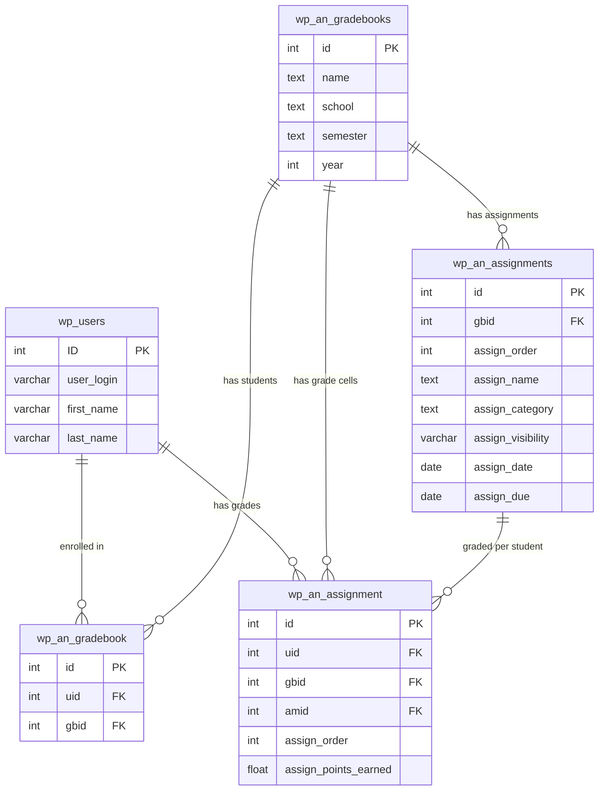

# GradeBook

A WordPress plugin for educators to create, maintain, and share grades directly from the dashboard.

## Features

### Instructor

- Create, edit, and delete courses
- Add, edit, and remove students (new or existing WordPress users)
- Create, edit, delete, and reorder assignments
- Edit grade cells inline
- Filter assignments by category and toggle visibility
- Sort by assignment columns
- Export gradebook data to CSV
- View student and assignment statistics with interactive charts

### Student

- View enrolled courses and grades
- View assignment details including due dates
- View performance statistics with pie and line charts

## Requirements

- WordPress 6.0+
- PHP 7.4+

## Installation

1. Upload the `an-gradebook` folder to `/wp-content/plugins/`, or install directly through the WordPress plugin screen.
2. Activate the plugin through **Plugins** in WordPress.
3. A **GradeBook** menu item will appear in the admin dashboard.

On activation, the plugin creates four database tables (`wp_an_gradebooks`, `wp_an_gradebook`, `wp_an_assignments`, `wp_an_assignment`) using the WordPress table prefix.

## Architecture

```
GradeBook.php                  Main plugin entry point
Gradebook-Database.php         Database schema setup (dbDelta)
functions.php                  Helper utilities
uninstall.php                  Cleanup on plugin deletion
Gradebook-RESTful-API/
  Course.php                   Course CRUD (wp_ajax)
  Assignment.php               Assignment CRUD (wp_ajax)
  Student.php                  Student CRUD (wp_ajax)
  Cell.php                     Grade cell updates (wp_ajax)
  Gradebook-API.php            Read-only endpoints (courses, gradebook, charts, CSV)
js/
  an-gradebook-namespace.js    Global namespace, nonce prefilter, utilities
  an-gradebook-instructor.js   Instructor entry point
  an-gradebook-student.js      Student entry point
  app/
    models/                    Backbone models and collections
    views/                     Backbone views
  lib/                         Bootstrap, jQuery UI
templates/                     Underscore.js templates
```

The frontend is a single-page application built on **Backbone.js** using WordPress-bundled jQuery, Backbone, and Underscore. All data flows through WordPress AJAX (`wp_ajax_*`) endpoints secured with nonce verification and capability checks.

## Development

### Local Testing

Build a plugin zip and upload it to your WordPress instance:

```bash
# From the repo root, create a zip excluding dev files
cd .. && zip -r an-gradebook.zip wp-gradebk \
  -x "wp-gradebk/.git/*" \
  -x "wp-gradebk/.github/*" \
  -x "wp-gradebk/.wordpress-org/*" \
  -x "wp-gradebk/.distignore" \
  -x "wp-gradebk/.gitignore" \
  -x "wp-gradebk/.gitattributes" \
  -x "wp-gradebk/.editorconfig" \
  -x "wp-gradebk/.DS_Store" \
  -x "wp-gradebk/node_modules/*" \
  -x "wp-gradebk/README.md"
```

Then in WordPress:

1. Go to **Plugins > Add New Plugin > Upload Plugin**
2. Choose the `an-gradebook.zip` file and click **Install Now**
3. Activate the plugin

To update an existing install, deactivate the current version first, delete it, then upload the new zip.

### Connecting to phpMyAdmin (Lightsail)

phpMyAdmin is only accessible from localhost on Bitnami/Lightsail stacks. Use an SSH tunnel:

```bash
# Download your SSH key from Lightsail console > Account > SSH keys
# Move it to ~/.ssh/ and lock down permissions
mv ~/Downloads/LightsailDefaultKey-<region>.pem ~/.ssh/
chmod 400 ~/.ssh/LightsailDefaultKey-<region>.pem

# Open the tunnel
ssh -N -L 8888:127.0.0.1:80 -i ~/.ssh/LightsailDefaultKey-<region>.pem bitnami@<INSTANCE_IP>
```

Then open `http://127.0.0.1:8888/phpmyadmin` in your browser.

- **Username:** `root`
- **Password:** Run `cat /home/bitnami/bitnami_credentials` on the instance

Useful queries for debugging:

```sql
-- Check plugin DB version
SELECT option_value FROM wp_options WHERE option_name = 'an_gradebook_db_version';

-- Verify tables exist
SHOW TABLES LIKE '%an_%';

-- Inspect data
SELECT * FROM wp_an_gradebooks;
SELECT * FROM wp_an_gradebook;
SELECT * FROM wp_an_assignments;
SELECT * FROM wp_an_assignment;
```

### Database

The plugin uses `dbDelta()` to manage the schema. Table definitions live in `Gradebook-Database.php`. On activation and on every `plugins_loaded`, the plugin checks `an_gradebook_db_version` in `wp_options` and runs `dbDelta()` if the version is stale.

#### Entity Relationship Diagram



`wp_an_gradebook` is the enrollment join table linking students to courses. `wp_an_assignment` is the grade cell table storing one row per student per assignment. Foreign keys are enforced at the application level, not the database level.

### AJAX Endpoints

All write endpoints require `manage_options` capability (WordPress Administrator). Read endpoints for students require only `is_user_logged_in()`. Every endpoint verifies the `an_gradebook_nonce` nonce.

| Action | Method | Description |
|--------|--------|-------------|
| `course` | POST/PUT/DELETE | Course CRUD |
| `assignment` | POST/PUT/DELETE | Assignment CRUD |
| `student` | POST/PUT/DELETE | Student CRUD |
| `cell` | PUT | Update a grade cell |
| `get_courses` | GET | List all courses |
| `get_gradebook_entire` | GET | Full gradebook for a course |
| `get_csv` | GET | Export gradebook as CSV |
| `get_pie_chart` | GET | Grade distribution for an assignment |
| `get_line_chart` | GET | Student progress chart |
| `get_student_courses` | GET | Courses for current student |
| `get_student_gradebook_entire` | GET | Student's gradebook view |

## License

GPL-2.0-or-later
