# GradeBook

A WordPress plugin for educators to create, maintain, and share grades directly from the dashboard.

## Features

### Instructor

- Create, edit, and delete courses
- Add, edit, and remove students (new or existing WordPress users)
- Create, edit, delete, and reorder assignments
- Edit grade cells inline
- Filter assignments by category and toggle visibility
- Sort by assignment columns
- Export gradebook data to CSV
- View student and assignment statistics with interactive charts

### Student

- View enrolled courses and grades
- View assignment details including due dates
- View performance statistics with pie and line charts

## Requirements

- WordPress 6.0+
- PHP 7.4+
- Node.js 20+ (for development)

## Installation

1. Upload the `an-gradebook` folder to `/wp-content/plugins/`, or install directly through the WordPress plugin screen.
2. Activate the plugin through **Plugins** in WordPress.
3. A **GradeBook** menu item will appear in the admin dashboard.

On activation, the plugin creates four database tables (`wp_an_gradebooks`, `wp_an_gradebook`, `wp_an_assignments`, `wp_an_assignment`) using the WordPress table prefix.

## Architecture

```
GradeBook.php                  Main plugin entry point
Gradebook-Database.php         Database schema setup (dbDelta)
functions.php                  Helper utilities
uninstall.php                  Cleanup on plugin deletion
rest-api/
  class-rest-courses.php       Courses CRUD + gradebook fetch + CSV export
  class-rest-assignments.php   Assignments CRUD
  class-rest-students.php      Students CRUD (new user + existing enrollment)
  class-rest-cells.php         Grade cell updates
  class-rest-stats.php         Pie chart + line chart data
  class-rest-student-view.php  Student-role endpoints (filtered by visibility)
src/                             TypeScript + React frontend
  index.tsx                      Entry point
  app.tsx                        Root component (routes by user role)
  api/                           API client modules (@wordpress/api-fetch)
  context/                       React Context + useReducer state management
  hooks/                         Custom hooks (use-gradebook, use-sorting)
  types/                         Shared TypeScript interfaces and type definitions
  components/
    instructor-app.tsx           Instructor root
    student-app.tsx              Student root
    course-list/                 Course list table (wp-list-table, row-actions)
    gradebook-table/             Gradebook spreadsheet (inline editing, sort, filter)
    student-course-list/         Student course list (read-only)
    student-gradebook/           Student gradebook (read-only)
    charts/                      Recharts pie + line charts
    modals/                      Modal dialogs (forms, confirmations, stats)
  styles/
    gradebook.css                Custom styles (extends WordPress admin classes)
build/                           Generated by @wordpress/scripts (not committed)
```

The frontend is a TypeScript React single-page application rendered inside the standard WordPress admin `wrap` container. UI follows WordPress admin conventions: `wp-list-table` for course listing, `wp-heading-inline` / `page-title-action` for page headings, and `row-actions` for item-level actions. All data flows through the WordPress REST API (`/wp-json/an-gradebook/v1/`) secured with nonce verification and capability checks. React and ReactDOM are provided by WordPress core via `wp-element` — they are not bundled into the plugin. TypeScript is type-checked with `tsc --noEmit` and transpiled by Babel via `@wordpress/scripts`.

## Development

### Prerequisites

- Node.js 20+
- npm
- Docker (for local development)

### Setup

```bash
git clone https://github.com/aorinevo/wp-gradebk.git
cd wp-gradebk
npm install
```

### Commands

| Command | Description |
|---------|-------------|
| `npm run build` | Production build to `build/` |
| `npm start` | Development build with watch mode (auto-rebuild on file changes) |
| `npm run typecheck` | Type-check all TypeScript files (no emit) |
| `npm run lint` | Lint all source files (ESLint + Prettier) |
| `npm run lint:fix` | Auto-fix lint and formatting issues |
| `npm run format` | Auto-format all source files with Prettier |
| `npm run env:start` | Start local WordPress environment (Docker) |
| `npm run env:stop` | Stop containers (data preserved) |
| `npm run env:destroy` | Remove containers and all data |
| `npm run env:cli -- <command>` | Run WP-CLI commands (e.g. `npm run env:cli -- plugin list`) |

### Local Development

The project uses [`@wordpress/env`](https://developer.wordpress.org/block-editor/reference-guides/packages/packages-env/) to run a local WordPress instance in Docker with the plugin automatically mounted and activated.

**First-time setup:**

```bash
npm run env:start     # Starts WordPress at http://localhost:8888
npm run build         # Initial build of the React app
```

**Development workflow:**

```bash
npm start             # Start watch mode (rebuilds on every file change)
```

Then open http://localhost:8888/wp-admin and navigate to the **GradeBook** menu. Edit any file in `src/` — webpack rebuilds automatically — then refresh the browser to see your changes.

**Default credentials:** `admin` / `password`

**Stopping and resetting:**

```bash
npm run env:stop      # Stop containers, keep data
npm run env:destroy   # Remove everything, start fresh next time
```

### Connecting to phpMyAdmin (Lightsail)

phpMyAdmin is only accessible from localhost on Bitnami/Lightsail stacks. Use an SSH tunnel:

```bash
# Download your SSH key from Lightsail console > Account > SSH keys
mv ~/Downloads/LightsailDefaultKey-<region>.pem ~/.ssh/
chmod 400 ~/.ssh/LightsailDefaultKey-<region>.pem

# Open the tunnel
ssh -N -L 8888:127.0.0.1:80 -i ~/.ssh/LightsailDefaultKey-<region>.pem bitnami@<INSTANCE_IP>
```

Then open `http://127.0.0.1:8888/phpmyadmin` in your browser.

- **Username:** `root`
- **Password:** Run `cat /home/bitnami/bitnami_credentials` on the instance

Useful queries for debugging:

```sql
-- Check plugin DB version
SELECT option_value FROM wp_options WHERE option_name = 'an_gradebook_db_version';

-- Verify tables exist
SHOW TABLES LIKE '%an_%';

-- Inspect data
SELECT * FROM wp_an_gradebooks;
SELECT * FROM wp_an_gradebook;
SELECT * FROM wp_an_assignments;
SELECT * FROM wp_an_assignment;
```

### Database

The plugin uses `dbDelta()` to manage the schema. Table definitions live in `Gradebook-Database.php`. On activation and on every `plugins_loaded`, the plugin checks `an_gradebook_db_version` in `wp_options` and runs `dbDelta()` if the version is stale.

#### Entity Relationship Diagram

```mermaid
erDiagram
    wp_users {
        int ID PK
        varchar user_login
        varchar first_name
        varchar last_name
    }
    wp_an_gradebooks {
        int id PK
        text name
        text school
        text semester
        int year
    }
    wp_an_gradebook {
        int id PK
        int uid FK
        int gbid FK
    }
    wp_an_assignments {
        int id PK
        int gbid FK
        int assign_order
        text assign_name
        text assign_category
        varchar assign_visibility
        date assign_date
        date assign_due
    }
    wp_an_assignment {
        int id PK
        int uid FK
        int gbid FK
        int amid FK
        int assign_order
        float assign_points_earned
    }
    wp_users ||--o{ wp_an_gradebook : "enrolled in"
    wp_an_gradebooks ||--o{ wp_an_gradebook : "has students"
    wp_an_gradebooks ||--o{ wp_an_assignments : "has assignments"
    wp_users ||--o{ wp_an_assignment : "has grades"
    wp_an_gradebooks ||--o{ wp_an_assignment : "has grade cells"
    wp_an_assignments ||--o{ wp_an_assignment : "graded per student"
```



`wp_an_gradebook` is the enrollment join table linking students to courses. `wp_an_assignment` is the grade cell table storing one row per student per assignment. Foreign keys are enforced at the application level, not the database level.

### REST API Endpoints

All instructor endpoints require `manage_options` capability (WordPress Administrator). Student endpoints require `is_user_logged_in()`. Nonce handling is automatic via the WordPress REST API framework (`wp_rest` nonce).

| Route | Methods | Description |
|-------|---------|-------------|
| `/an-gradebook/v1/courses` | GET, POST | List / create courses |
| `/an-gradebook/v1/courses/{id}` | PUT, DELETE | Update / delete a course |
| `/an-gradebook/v1/courses/{id}/gradebook` | GET | Full gradebook for a course |
| `/an-gradebook/v1/courses/{id}/export` | GET | Export gradebook as CSV |
| `/an-gradebook/v1/assignments` | POST | Create an assignment |
| `/an-gradebook/v1/assignments/{id}` | PUT, DELETE | Update / delete an assignment |
| `/an-gradebook/v1/students` | POST | Create / enroll a student |
| `/an-gradebook/v1/students/{id}` | PUT, DELETE | Update / delete a student |
| `/an-gradebook/v1/cells` | PUT | Update a grade cell |
| `/an-gradebook/v1/stats/assignment/{amid}` | GET | Grade distribution (pie chart) |
| `/an-gradebook/v1/stats/student` | GET | Student progress (line chart) |
| `/an-gradebook/v1/student/courses` | GET | Courses for current student |
| `/an-gradebook/v1/student/courses/{id}/gradebook` | GET | Student's gradebook view |
| `/an-gradebook/v1/stats/student/me` | GET | Student's own progress chart |

### CI/CD

- **Release:** On push to `main`, [semantic-release](https://github.com/semantic-release/semantic-release) runs `npm run build`, bumps the version, updates the changelog, and creates a GitHub release with a tag.
- **Deploy:** On tag push (or manual `workflow_dispatch` with "deploy" confirmation), the plugin is built, deployed to WordPress.org via SVN, and a zip artifact is attached to the GitHub release.

## License

GPL-2.0-or-later
